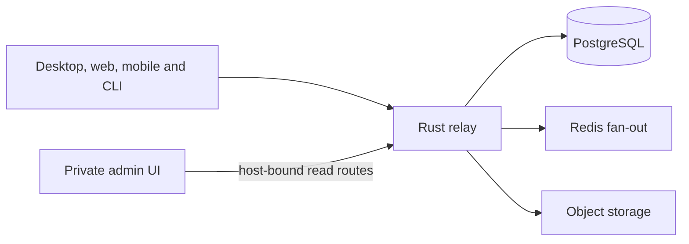

# Buzz

A self-hostable workspace where humans and agents share channels, code and workflows. This repository is the `jckail/buzz` fork of [upstream Buzz](https://github.com/block/buzz); upstream release infrastructure and internal Block services are separate projects.

## Client surfaces

| Surface | Purpose | Source |
| --- | --- | --- |
| Desktop | Tauri/React workspace for communities, channels, agents and settings | [desktop](desktop) |
| Web | Browser repository explorer and invite flows | [web](web) |
| Admin | Private, deployment-wide read-only reports and feedback | [admin-web](admin-web), [operator guide](docs/admin/README.md) |
| Mobile | Flutter client | [mobile](mobile/README.md) |
| CLI and agent harness | Signed relay operations and ACP agent integration | [crates](crates), [contributor guide](CONTRIBUTING.md) |

The Rust relay verifies signed Nostr events, applies host-derived community scope, persists data and fans out updates. A browser route or client selection does not grant authorization. The admin host is a separate private-ingress boundary, not a public cross-community API.



[Frontend architecture](docs/frontend/architecture.mdx) · [Developer guide](docs/frontend/developer.mdx) · [System architecture](ARCHITECTURE.md) · [Vision](VISION.md) · [Roadmap context](VISION_PROJECTS.md)

## Run from source

Activate the pinned Hermit environment before repo tools and hooks:

```bash
. ./bin/activate-hermit
just setup
just relay       # local relay
just dev         # relay plus native desktop app
```

`just setup` installs tools/dependencies, starts local infrastructure and applies migrations. Review [CONTRIBUTING.md](CONTRIBUTING.md) and `.env.example` first. It is not required for a read-only source audit. Native desktop functionality needs Tauri; a plain browser preview requires the existing mock bridge. See [TESTING.md](TESTING.md).

For the admin UI, `just admin-seed` supplies local synthetic fixtures and `just admin` builds/serves the dashboard. These start infrastructure and create data; use an isolated local environment. No live admin access or deployment is established by this README.

## Contribute and verify

Use conventional commit subjects and `git commit -s` for DCO sign-off. Follow existing formatting/hooks and the contributor guide. `just ci` is the full repository gate; focused admin checks live under `admin-web`. Shared agent workspaces serialize installs, builds and broad suites through the verification owner/resource wrapper.

```bash
pnpm -C admin-web typecheck
pnpm -C admin-web exec vitest run src --maxWorkers=2
```

The admin resource hook isolates data/errors by the current request key. A route change hides the previous record immediately; same-key refreshes retain data with visible loading/failure feedback and retry. [JCK-93](https://linear.app/jckail/issue/JCK-93/prevent-stale-admin-records-across-resource-navigation) tracks that fix.

[Design canvas](https://superdesign.dev/teams/daa6c1df-346f-4dc3-81dd-fb4f462aff90/projects/ae751471-cf50-4769-9f25-8ce2db0bf763) · [Linear project](https://linear.app/jckail/project/buzz-53066191ff65) · [Release procedures](RELEASING.md) · [Security and contribution policy](CONTRIBUTING.md) · [Apache 2.0 license](LICENSE)
