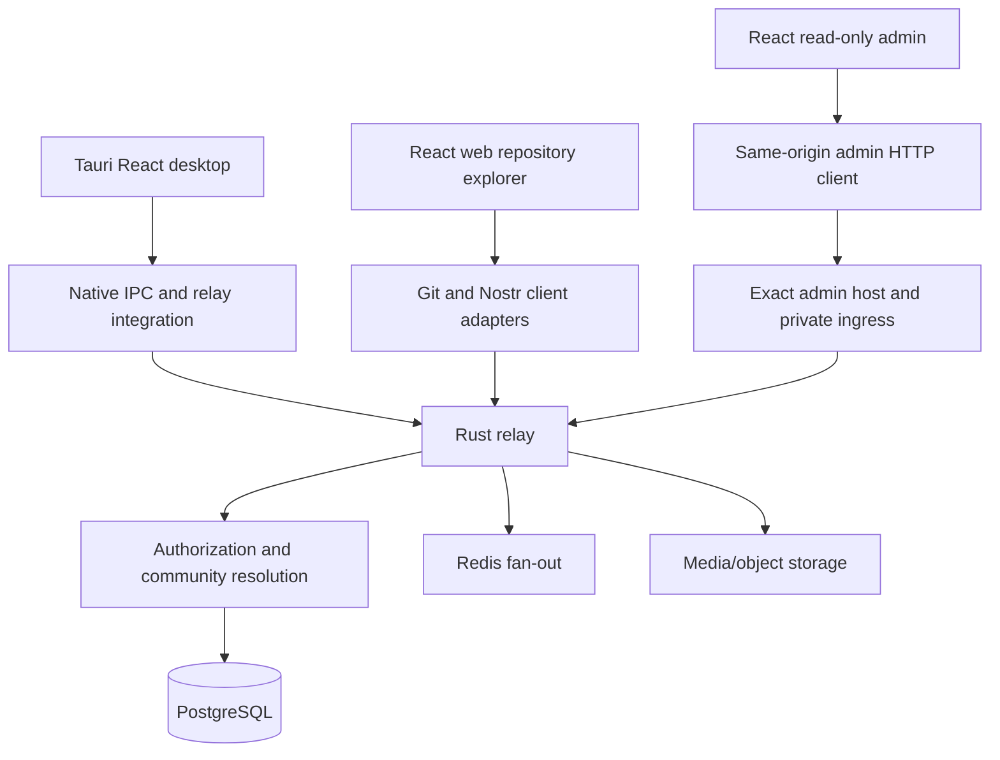
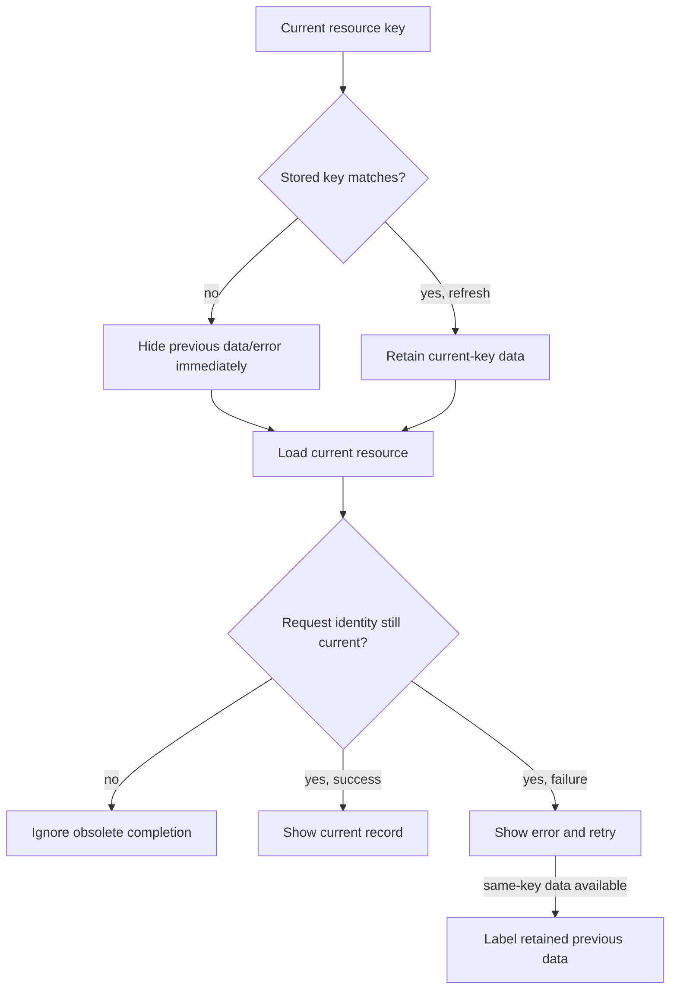

# Buzz frontend architecture

These source-qualified notes describe this fork's committed client surfaces. They do not establish a running relay, operator ingress, native desktop build or deployed admin instance. [ARCHITECTURE.md](../../ARCHITECTURE.md) covers the broader protocol and services.

## Separate client responsibilities

- **Desktop:** [main.tsx](../../desktop/src/main.tsx) mounts community/theme providers; [App.tsx](../../desktop/src/app/App.tsx) owns initialization and the community-scoped application tree. React remounting does not reset module-level caches: existing community reset machinery handles those boundaries. Tauri IPC is part of the product, so a browser-only screenshot requires the repository's mock bridge.
- **Web:** [main.tsx](../../web/src/main.tsx) mounts TanStack Query, theme and UI providers. [router.tsx](../../web/src/app/router.tsx) serves repository browsing and invitation flows; [ReposPage.tsx](../../web/src/features/repos/ui/ReposPage.tsx) renders the repository list. This is not the full desktop messaging client.
- **Admin:** [main.tsx](../../admin-web/src/main.tsx) mounts a small React application. [App.tsx](../../admin-web/src/App.tsx) routes report/feedback lists and details; [api.ts](../../admin-web/src/api.ts) requests only the same-origin `/api/admin/v1` surface.

Shared labels do not mean shared browser state or an identical visual system. Web/desktop use their source theme tokens and Tailwind primitives; the admin dashboard has its own CSS, gradient palette and system-font stack.

## Admin resource lifecycle

[useResource.ts](../../admin-web/src/useResource.ts) associates data, error and loading with a key. Display masking happens during render rather than waiting for an effect. Unique request identities prevent an old A request from reappearing after navigation A→B→A. A same-key failed refresh is visibly stale and retryable; it is not presented as a fresh successful read.

This prevents stale records from appearing under another detail URL. It does not replace server authorization, cancel the underlying network request, or make an already received response private again. [Admin operator boundaries](../admin/README.md) remain authoritative: configured host/origin, private ingress and feedback-scoped attachment authorization.

## Verification and limits

Hook tests cover first committed render, key-scoped errors, late/ABA completion and same-key failure/retry. Mounted App tests navigate report and feedback records to pending/403/404 states, using synthetic in-memory requests. These are UI correctness checks, not live access tests. Source imports on the design canvas disclose their fixture mode and never contain real operator records or credentials.
