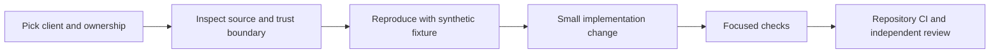

# Buzz frontend developer guide

Start with [CONTRIBUTING.md](../../CONTRIBUTING.md) and [AGENTS.md](../../AGENTS.md). Activate `bin/activate-hermit` before repo tools and hooks. Existing upstream release workflows, third-party/vendor code and another session's working tree are separate from a bounded client fix.

## Choose the surface first

| Work | Entry point | Verification |
| --- | --- | --- |
| Web repository/invite UI | [web/src/app](../../web/src/app) | Web package checks and existing browser tests |
| Native desktop UI | [desktop/src/app](../../desktop/src/app) | Desktop checks; existing E2E mock bridge for browser review |
| Admin reports/feedback | [admin-web/src](../../admin-web/src) | TypeScript, focused Vitest and synthetic route/browser tests |
| Protocol, authorization or storage | [crates](../../crates) | Relevant Rust tests plus integration requirements |



## Admin changes

The request key must identify the record being shown. Do not use a mounted component's previous response as data for a new route. Check both pending navigation and failed/forbidden navigation, including the first committed render before effects reset state. Late requests must not overwrite newer work, even when the key cycles back to an earlier value.

For same-key refresh, keep previous content only with explicit refresh/error feedback and a usable Retry action. Tests in [useResource.test.tsx](../../admin-web/src/useResource.test.tsx), [App.routes.test.tsx](../../admin-web/src/App.routes.test.tsx) and [App.state.test.tsx](../../admin-web/src/App.state.test.tsx) cover these transitions. Mock transport responses in process or through Playwright routing; do not point tests at a live operator host.

```bash
pnpm -C admin-web typecheck
pnpm -C admin-web exec vitest run src --maxWorkers=2
```

Full verification still follows repository policy (`just ci`, plus applicable admin checks). In a shared agent environment, serialize expensive installs/builds/suites; report lock contention or missing tools rather than bypassing the gate. Borrowed local dependencies can help reproduce a bug but do not establish lockfile/runtime compatibility.

## Design review artifacts

Use actual React output and source CSS where possible, with synthetic reports, feedback and identities. Native desktop scenes need the existing bridge; isolated pure components must be labeled as such. Static HTML imports are inert snapshots, not shipped interactions or proof of deployment.

Preserve project/draft version history. Record the source revision, fixture mode, warnings, exact HTML readback and any missing runtime coverage. Do not upload live admin payloads, private attachments, access tokens or investigation material. Link changes to the verified [Buzz Linear project](https://linear.app/jckail/project/buzz-53066191ff65) and [JCK-93](https://linear.app/jckail/issue/JCK-93/prevent-stale-admin-records-across-resource-navigation).
